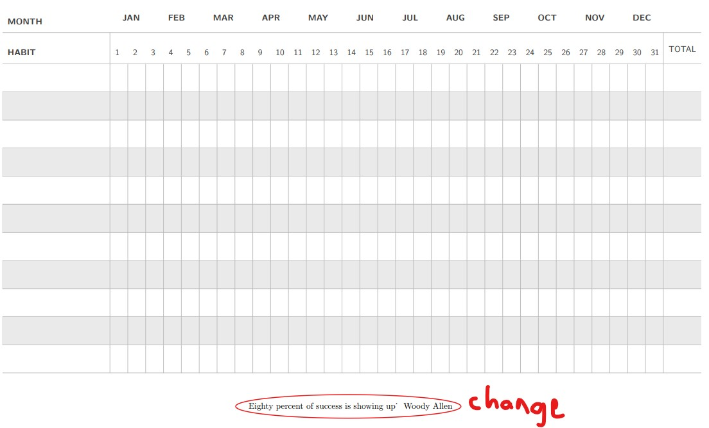

# Habit Tracker PDF Generator

This project generates a specified number of habit tracker PDFs with random quotes in the footer and merges them into a single PDF file.

## File Structure

- `main.py`: The main script to generate and merge habit trackers.
- `habit_traker.tex`: The LaTeX template for the habit tracker.
- `requirements.txt`: The list of Python dependencies.

## Setup Instructions

### Prerequisites

- Python 3.x
- Pip (Python package installer)
- LaTeX distribution (e.g., TeX Live or MiKTeX)

### Installation

1. **Clone the Repository:**

   ```bash
   git clone https://github.com/your-username/your-repository.git
   cd your-repository
   ```

2. **Create and Activate a Virtual Environment:**

    ```bash
    python -m venv venv
    source venv/bin/activate  # On Windows, use `venv\Scripts\activate`
    ```

3. **Create and Activate a Virtual Environment:**

    ```bash
    pip install -r requirements.txt
    ```

## Usage

### Run the Script:

    ```bash
    python main.py
    ```

### Enter the Number of Habit Trackers:

You will be prompted to enter the number of habit trackers to create. Enter a number and press Enter.

## Acknowledgments

Quotes are fetched from the [Quotable API](https://quotable.io).

